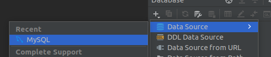

## Documentació Instal·lació sistema gestor de base de dades. MySQL

1. El primer que farem serà descarregar i instalar el mysql server, cosa que farem amb la comanda **"sudo apt-get install mysql-server"** i el descomprimim amb la comanda **"dpkg -L mysql-server"** 

2. A l`hora d'accedir al mysql ens demanarà un usuari y una contrasenya, les cuals les conseguirem anant a un fitxer que crea mysql per defecte que es diu **debian.cnf**, a l´hora d'iniciar ara el mysql el iniciarem amb el usuari que es troba en aquest fitxer i la contrasenya corresponent

3. Lo primer que farem una vegada instal·lat es crear una base de dades

I dins d'aquesta crearem una taula

Per a instal.lar el mysql workbench he tingut que descarregar els repositoris, els quals els he instal·lat amb **"sudo apt install ./mysql-apt-config_0.8.22-1_all.deb"**

Seguit d'aixó he fet un update i ja si que si he instal·lat l'aplicació amb **"sudo apt install mysql-workbench-community"**

4. Editem la Local Instance, el que farem serà modificar el usuari i la seua contrasenya

5. Altres eines que podem fer us es el PhpStorm

En aquest tenim que fer el matiex que en la anterior aplicació, anirem al aparta de mysql

Instal·larem els ultims drivers si no els tenim

I configurem el usuari i contrasenya per defecte

I veurem que tenim access

Una vegada fet aixó tindrem totes les taules carregades correctament

Anem i creem una nova tasca, la cual anomerarem **tasca 1**

Per a practicar una mica més en PDO ens anem a la carpeta que es mostrarà acontinuació

Així que dins de la carpeta que hem creat farem us de la comanda **phpstorm .**

I si ho hem fet be se mos obrirà el projecte

Crearem un fitxer anomenat **index.php** i fem una proba amb un Hola mon!

Modificarem el fitxer anterior de tal manera que ens puguesem connectar amb el usuari i la contrasenya, i també le afegirem els ultims recurso per a que sigui un PDO

